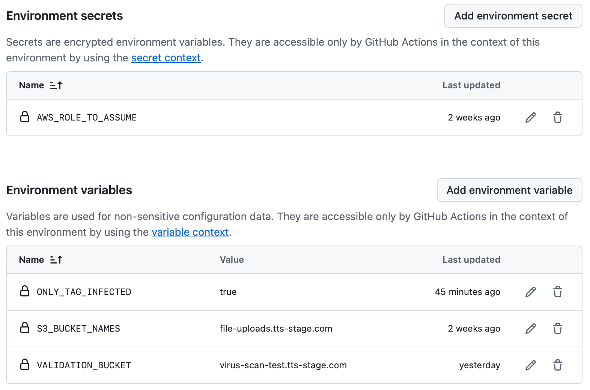
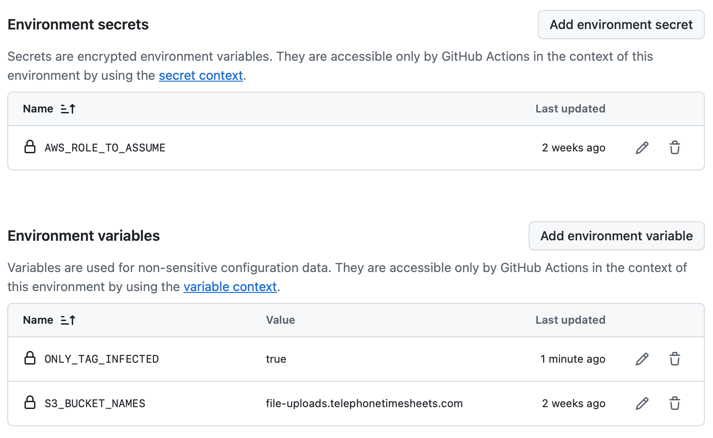

# Java CDK Serverless ClamAV Scanner

A streamlined, Java-powered solution for scanning files uploaded to Amazon S3 using ClamAV — deployed with AWS CDK and optimized for performance, simplicity, and production-readiness.

---

## 💡 Why This Project?

The inspiration for this project came from reviewing the [AWS Labs cdk-serverless-clamscan](https://github.com/awslabs/cdk-serverless-clamscan) repository. While that solution is powerful and flexible, it also comes with significant complexity:

| AWS Labs Solution                                  | This Project                                                  |
|----------------------------------------------------|---------------------------------------------------------------|
| Projen + Typescript + Python + Node.js + Lambda    | ✅ Pure Java (Java 21) for both Lambda and CDK                |
| ClamAV DB stored in S3 + loaded at runtime, VPC, EFS         | ✅ ClamAV DB bundled in Docker image at build time            |
| Multiple constructs and wiring layers              | ✅ Single CDK stack, minimal moving parts                     |
| Manual or external event setup                     | ✅ Dynamically configures bucket notifications + permissions  |
| No GitHub automation baked in                      | ✅ Includes full GitHub Actions CI/CD workflow                |
| Multiple language bindings (JSII)                  | ✅ Simple Java Maven modules, fast to understand & run        |
| EventBridge + SNS integration baked in             | ✅ Focused S3 trigger → Lambda tagging flow                   |

> This repo exists because not every virus scan pipeline needs an entire JSII-powered TypeScript library.  
> Sometimes, you just need **high-performance, maintainable infrastructure** in a language your backend team already uses.

---

## 🚀 What It Does

- Scans uploaded S3 objects for viruses using **ClamAV**
- Tags infected/clean files with a `scan-status` object tag
- Uses **Java 21**, optimized with **AWS SDK v2 + CRT-based async S3 client**
- Deploys via **container-based AWS Lambda** using **ARM64** for speed and cost efficiency
- Dynamically wires up **any bucket(s)** via CDK to trigger scan and applies needed IAM permissions
- Validation as part of pipeline to ensure container properly detects virus files (optional)

---

## 🛠 Tech Stack

- **Java 21** — modern, high-performance backend language
- **AWS SDK v2 Async (CRT)** — blazing-fast, non-blocking I/O
- **CDK (Java)** — type-safe infrastructure-as-code
- **Docker** — multi-stage image with ClamAV + latest definitions
- **Lambda** — serverless + scalable compute
- **GitHub Actions** — automated CI/CD pipeline ready to go

---

## 🧩 Modules

| Module     | Purpose                                                  |
|------------|----------------------------------------------------------|
| `lambda/`  | Java-based ClamAV Lambda function                        |
| `cdk/`     | CDK stack that provisions S3, Lambda, and IAM roles      |
| `integration-test/` | Optional: test framework to validate scan pipeline |
| `shared-model/`     | Common definitions used in lambda and test packages |

---

## 🏎 Performance & Cost

- Uses **ARM64** Lambda base image for faster cold starts and lower runtime cost
- **ClamAV definitions** are embedded at Docker build time — no S3 download needed at runtime
- **Only tags infected files by default** (configurable via workflow var or ENV var)
- **No public internet required** for virus definitions or dependency download at runtime and no VPC,EFS necessary

---

## 🚀 CLI Build & Deploy (ARM Platform Mac)

If you have [brew](https://brew.sh) installed (highly recommended) then:
```bash
brew install aws-cdk
brew install corretto21
brew install maven
brew install --cask docker
```

Assuming you have all requried software, CDK is bootstraped and you have valid AWS Keys set then:

```bash
# Clone Repo
git clone https://github.com/docwho2/java-cdk-serverless-clamscan.git

# CD into main repo dir
cd java-cdk-serverless-clamscan

# Build the Project and copy Lambda JAR to Docker context
mvn install

# CDK deploy with S3 bucket names to watch for S3 Create Events
cd cdk

# Set buckets and whether you want to tag only INFECTED files only or set tag on all files (SCANNING,CLEAN,ERROR,INFECTED,etc.)
cdk deploy --context bucketNames="bucketName1,bucketName2" --context ONLY_TAG_INFECTED="true|false"
```

## 🚀 CLI Build & Deploy x86 (AWS CloudShell)

Easiest method to get deployed since this is a clean environment that will have AWS Creds all loaded assuming you have a role that 
grants all the needed permissions (Administrator or Power User).  If you just want to test it out quickly this is will get you going fast and easy! 
Since its quite more complicated to get CloudShell to build arm64, this will build everything for x86.  The CDK code detects CloudShell and then 
targets x86 platform.  For production you'll like integrate into your own pipeline strategy or use GitHub Workflow which can build arm64 easily.

```bash
# Clone Repo
git clone https://github.com/docwho2/java-cdk-serverless-clamscan.git

# CD into main repo dir
cd java-cdk-serverless-clamscan

# Source cloudshell file to prep Cloud Shell with Java/Maven/CDK
source cloudshell.sh

# Build the Project and copy Lambda JAR to Docker context
mvn install

# CDK deploy with S3 bucket names to watch for S3 Create Events
cd cdk

# Set buckets and whether you want to tag only INFECTED files only or set tag on all files (SCANNING,CLEAN,ERROR,INFECTED,etc.)
cdk deploy --context bucketNames="bucketName1,bucketName2" --context ONLY_TAG_INFECTED="true|false"
```

## 🚀 Forking repository and utlizing the GitHub Workflow

The [GitHub Workflow](.github/workflows/deploy.yml) included in the repository can be used to a create a full CI/CD pipeline as changes are comitted to the main branch or on a schedule to keep your virus definitions up to date.

To allow the workflow to operate on your AWS environment, you can use several methods, but in this case we are using the recommended [OIDC method](https://github.com/aws-actions/configure-aws-credentials#OIDC) that requires some setup inside your account.  The workflow uses this to setup Credentials:

```yaml
- name: Setup AWS Credentials
      id: aws-creds
      uses: aws-actions/configure-aws-credentials@v4
      with:
        aws-region: ${{ matrix.region }}
        # The full role ARN if you are using OIDC
        # https://github.com/aws-actions/configure-aws-credentials#oidc
        role-to-assume: ${{ secrets.AWS_ROLE_TO_ASSUME }}
        # Set up the below secrets if you are not using OIDC and want to use regular keys (best practice is to use just role above with OIDC provider)
        aws-access-key-id: ${{ secrets.AWS_ACCESS_KEY_ID }}
        aws-secret-access-key: ${{ secrets.AWS_SECRET_ACCESS_KEY }}
        mask-aws-account-id: true
```

You will need to [create secrets](https://docs.github.com/en/actions/security-for-github-actions/security-guides/using-secrets-in-github-actions#creating-secrets-for-an-environment) to use OIDC or Keys.  Set the role or Keys, but not both:

If you are using the [OIDC method](https://github.com/aws-actions/configure-aws-credentials#OIDC)
- Create a Secret named **AWS_ROLE_TO_ASSUME** and set it to the full ARN of the role
  - It should look something like "arn:aws:iam::123456789:role/github-oidc-provider-Role-nqvduv7P15BZ"

If you are going to use [Access Key and Secret](https://repost.aws/knowledge-center/create-access-key)
- Create a Secret named **AWS_ACCESS_KEY_ID** and set to the Access Key ID
- Create a Secret named **AWS_SECRET_ACCESS_KEY** and set to the Secret Access Key

The workflow is designed for a matrix job based on [environments](https://docs.github.com/en/actions/writing-workflows/choosing-what-your-workflow-does/using-environments-for-deployment).  Each environemnt should 
generally represent a unique deployment within a region and/or account.  We use seperate accounts for stagging versus production.

- stage-us-east
  - This is stagging account used for testing
  - We set VALIDATION_BUCKET for this environment so tests run to validate the resulting container detects infected files correctly
    - Since the container has all the virus definitions built in, we want to validate it works properly before releasing into production.
- prod-us-east
  - For this environment we set a [wait timer](https://docs.github.com/en/actions/managing-workflow-runs-and-deployments/managing-deployments/managing-environments-for-deployment#wait-timer) of 30 mins
    - This delays running and deploying into production so if the stage workfkow (namely the tests fail) the container is not deployed into production
    - You could also create protection rules or similar so someone has to approve this deploy vs the simple wait

```yaml
jobs:
  deploy:
    strategy:
      matrix:
        # Define which environments you want to deploy
        # Environments are setup in GutHub
        environment: [ stage-us-east, prod-us-east ]
```


Example [Variables](https://docs.github.com/en/actions/writing-workflows/choosing-what-your-workflow-does/store-information-in-variables#creating-configuration-variables-for-an-environment) :

stage-us-east environment example:


prod-us-east environment example:


The general steps are:
* [Fork the repository](https://docs.github.com/en/get-started/quickstart/fork-a-repo)
* [Setup required Secrets](https://docs.github.com/en/actions/security-for-github-actions/security-guides/using-secrets-in-github-actions#creating-secrets-for-an-environment) for each environment you want.
  - Setup either OIDC or Access Keys as described above.
* Setup [variables](https://docs.github.com/en/actions/writing-workflows/choosing-what-your-workflow-does/store-information-in-variables#creating-configuration-variables-for-an-environment) for each environment.
  - **S3_BUCKET_NAMES** is a comma seperated list of S3 bucket names to perform scanning on
    - CDK deployment will allow the Container Lambda to Read Object and write tags and subscrive to Obect Create events to trigger the scan
  - Set **ONLY_TAG_INFECTED** to "true" or "false"
    - When true, only infected files will get tagged with INFECTED.  This is the default if you don't set this.
    - When false tagging is applied immedaitely as files are processed
        - SCANNING tag is set immediately
        - Then a terminating tag is applied after scanning is done (or errors) -> CLEAN,INFECTED,ERROR
  - If you set **VALIDATION_BUCKET** to an S3 bucket name this indicates you want to run validation tests for this environment
    - The bucket is added to S3_BUCKET_NAMES passed to the CDK deploy so that events for the test bucket also trigger scans
    - This requires manual setup of the validation bucket and placing files in the bucket to coordiate with the [testing code](integration-test/src/main/java/cloud/cleo/clamav/test/VirusScanValidationTest.java) 


---

## 📌 Applying S3 Bucket Policy

This project performs the tagging only on S3 Objects, so once a tag is applied its likely you want to prevent download of the file so a 
[S3 Bucket Polcy](https://docs.aws.amazon.com/AmazonS3/latest/userguide/access-policy-language-overview.html?icmpid=docs_amazons3_console) is 
the way to go.

If you opt to tag only infected files, then its rather simple policy that should deny reads on infected files:

```json
{
    "Version": "2012-10-17",
    "Statement": [
        {
            "Sid": "DenyReadIfInfected",
            "Effect": "Deny",
            "Principal": "*",
            "Action": "s3:GetObject",
            "Resource": "arn:aws:s3:::your-bucket-name/*",
            "Condition": {
                "StringEquals": {
                    "s3:ExistingObjectTag/scan-status": "INFECTED"
                }
            }
        }
    ]
}
```

If you want to look at all tags (**ONLY_TAG_INFECTED** = false) and deny download while scanning is in progres and essentially only allow CLEAN files to download then something like this might apply:

```json
{
    "Version": "2012-10-17",
    "Statement": [
        {
            "Sid": "DenyReadIfScanning",
            "Effect": "Deny",
            "Principal": "*",
            "Action": "s3:GetObject",
            "Resource": "arn:aws:s3:::your-bucket-name/*",
            "Condition": {
                "StringEquals": {
                    "s3:ExistingObjectTag/scan-status": [
                        "SCANNING",
                        "INFECTED",
                        "ERROR"
                    ]
                }
            }
        }
    ]
}
```

---

## 📌 Responding to tag events in Java

Since this project has a defined scope of only tagging files and is designed to be deployed outside the scope of a VPC (keep it simple) your application 
code might need to react to INFECTED files.  Here is an example in Java.

```Java
public class S3ClamAVProcessor implements RequestHandler<S3EventNotification, Void> {

    // Initialize the Log4j logger.
    static final Logger log = Logger.getLogger(S3ClamAVProcessor.class);

    // Data Service Layer
    static final DSLContext dsl = IVRDataSource.getDSL();
    
    static final S3Client s3 = S3Client.create();

    @Override
    public Void handleRequest(S3EventNotification s3event, Context context) {
        for (S3EventNotification.S3EventNotificationRecord record : s3event.getRecords()) {
            log.debug(record);
            String eventName = record.getEventName();
            if (!"ObjectTagging:Put".equals(eventName)) {
                log.warn("Not Object Tagging event, ignoring");
                continue;
            }

            String bucket = record.getS3().getBucket().getName();
            String key = record.getS3().getObject().getUrlDecodedKey();

            // Fetch the tags
            GetObjectTaggingResponse tagging = s3.getObjectTagging(GetObjectTaggingRequest.builder()
                    .bucket(bucket)
                    .key(key)
                    .build());

            boolean isInfected = tagging.tagSet().stream()
                    .anyMatch(tag -> "scan-status".equals(tag.key()) && "INFECTED".equalsIgnoreCase(tag.value()));

            if (isInfected) {
                log.debug("File is infected, setting infected flag on: " + key);
                
                // Look up DB row and set status so front-end shows infected to users
                try {
                    int result = dsl.update(FILE_UPLOADS)
                            .set(FILE_UPLOADS.INFECTED,true)
                            .where(FILE_UPLOADS.UUID.eq(UUID.fromString(key)))
                            .execute();
                    if ( result > 0 ) {
                        log.debug("infected status updated on record");
                    } else {
                        log.warn("file_uploads record not found, could not update");
                    }

                    // Perform any other business logic, send email, etc.

                } catch ( DataAccessException dae) {
                    // Allow retry on lambda if DB down
                    log.warn("DAE, throwing for retry",dae);
                    throw dae;
                } catch( Exception e ) {
                    // swallow anything else, likely logic error
                    log.error("Could not update infected flag",e);
                }
            } else {
                log.warn("Tag set does not indicate INFECTED, ignoring");
            }
        }

        return null;

    }
}
```

In this example, the lambda receives ObjectTagging events and is subscribed for bucket notifications.  Cloudformation for such a lambda might look like:

```yaml
S3ClamAVProcessor:
        Type: AWS::Serverless::Function
        DeletionPolicy: Delete
        Properties:
            FunctionName: S3ClamAVProcessor
            Description: Respond to S3 Events when virus detected on Objects
            Handler: com.sst.ivr.lambda.S3ClamAVProcessor
            MemorySize: 1024
            Timeout: 60
            CodeUri:
                Bucket: !Ref buildBucketName
                Key: !Ref buildObjectKey
            VpcConfig:
                SubnetIds: !Ref Subnets
                SecurityGroupIds: !Ref SecurityGroups
            Policies:
                - AmazonSSMReadOnlyAccess
                - Version: '2012-10-17'
                  Statement:
                    - Effect: Allow
                      Action: s3:GetObjectTagging
                      Resource: !Join
                        - ""
                        - - "arn:aws:s3:::"
                          - !FindInMap [EnvMap, !Ref ENVIRONMENT, FileUploadsBucketName]
                          - "/*"
            # Need to add trigger by hand for s3:ObjectTagging:Put notification since stack did not create the S3 Bucket
```

---

## 📌 Goals

- Keep it **easy to understand**
- Use **modern Java everywhere**
- Make it **fast**, **cheap**, and **maintainable**
- Minimize dependencies and runtime configuration
